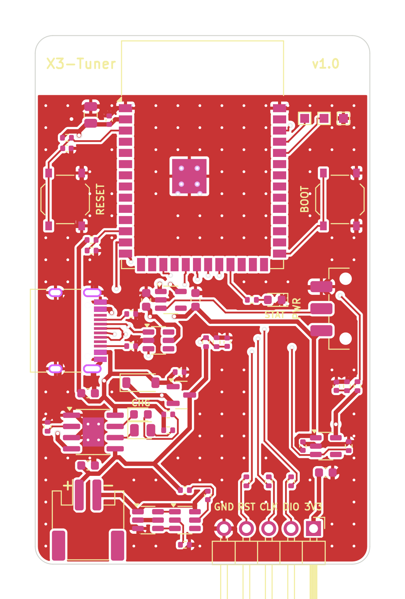
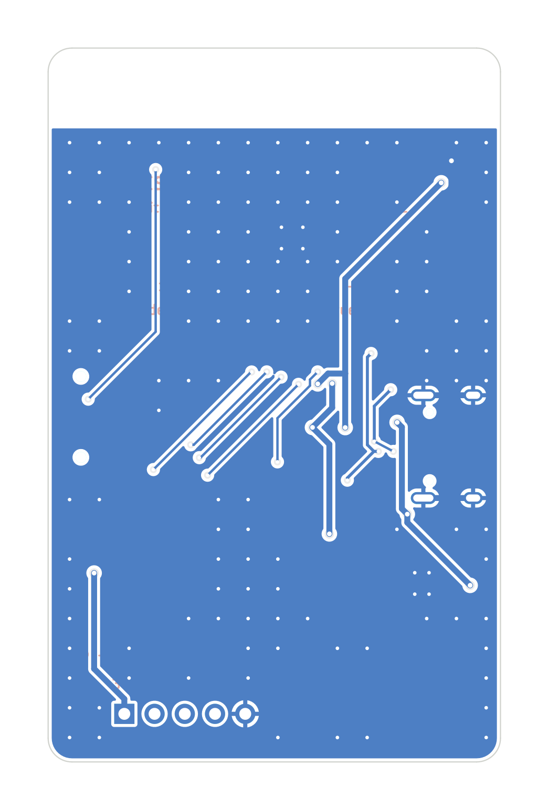
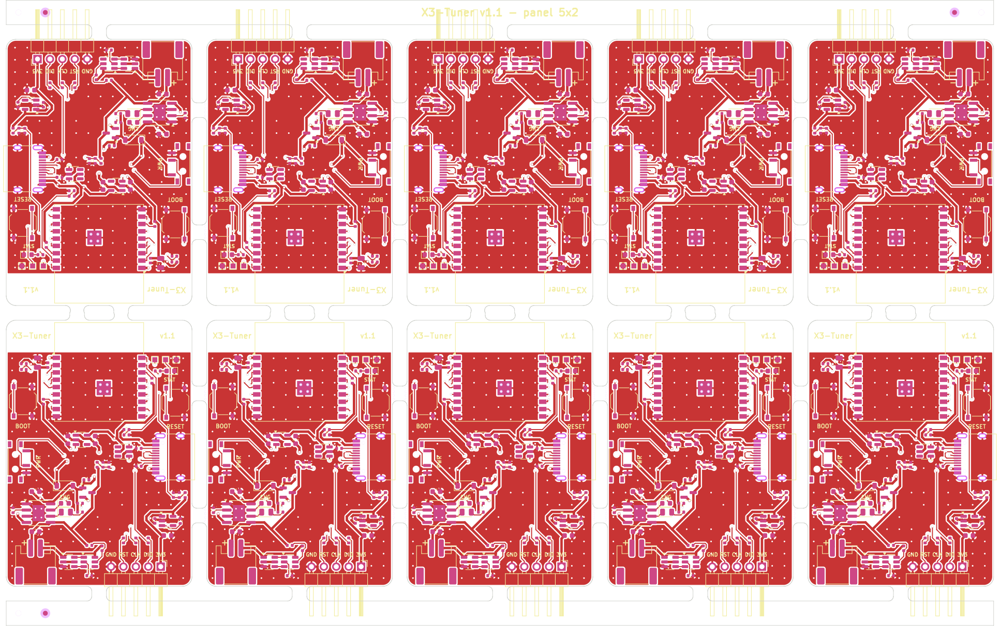
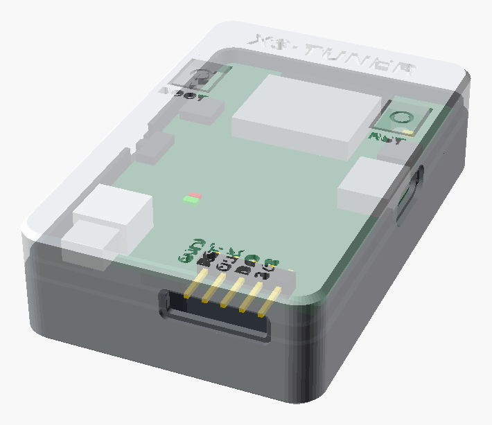
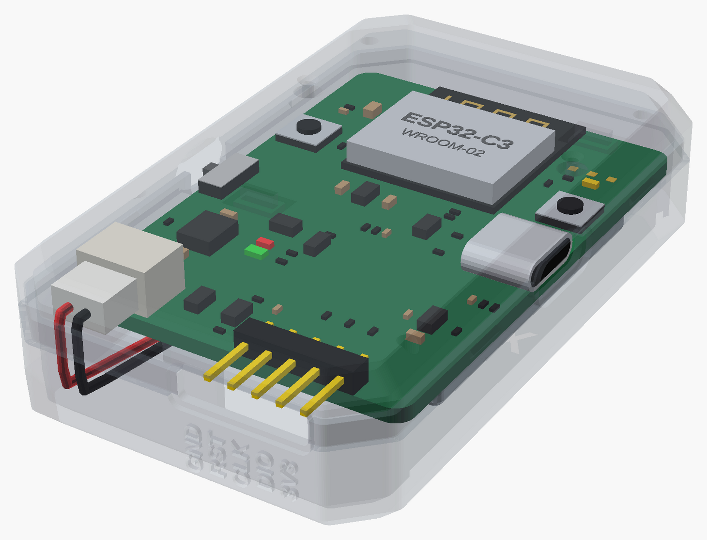
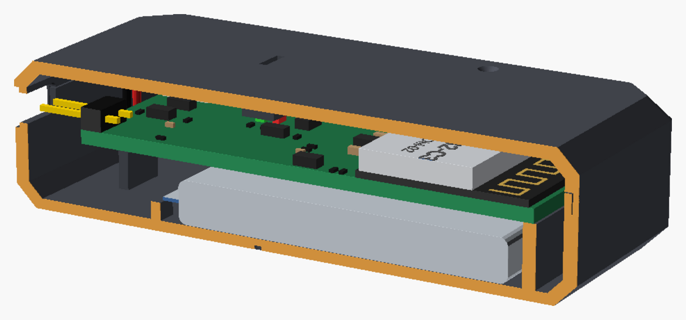

# X3-Tuner – eigene Platine für x3utils-esp32

Ein **All-in-one-Gerät** für die AT32F415-VCU der X3-Scooter-Familie (ZT3 Pro,
Max G3, F3 / F3 Pro): ESP32-C3 (Spar-Version), eigener Akku mit Lade- und
Schutzschaltung, schaltbare 3,3-V-Versorgung für die VCU und ein SWD-Stecker.
Ersetzt **ST-LINK, PC und Kabelsalat** – bedient wird alles per Handy-Browser
über WLAN (Firmware: dieses Repository, Environment `x3tuner`).

| Oberseite | Unterseite |
|---|---|
|  |  |

[Schaltplan (PDF)](docs/x3tuner-schematic.pdf) ·
[Bestückungsplan (PDF)](docs/x3tuner-assembly.pdf) ·
[Fertigungsdaten](production/) ·
[3D-Druck-Gehäuse](case/)

> [!IMPORTANT]
> **Status: Design fertig (Rev. 1.1, Spar-Version mit ESP32-C3), noch nicht gefertigt.** Die Platine besteht den
> KiCad-DRC (0 Fehler, 0 offene Verbindungen) und der Schaltplan wird
> automatisch gegen die Netzliste geprüft – ein gebauter Prototyp existiert
> aber noch nicht. Bitte zuerst **2–5 Stück** bestellen und testen. Was du vor
> der Bestellung prüfen solltest, steht unter [Vor der Bestellung prüfen](#vor-der-bestellung-prüfen).

---

## Was drauf ist

| Block | Lösung | Warum |
|---|---|---|
| MCU | **ESP32-C3-WROOM-02-N4**: 4 MB Flash, 400 KB RAM, WLAN + BLE | ca. 1,20–1,55 $ günstiger als der S3; die Firmware braucht nur 128 KB Puffer |
| USB | USB-C direkt an GPIO18/19 (natives USB des C3) | kein CH340/CP2102 nötig → günstiger |
| Laden | **TP4056**, ca. 360 mA (R4 = 3,3 kΩ), LEDs rot = lädt, grün = voll | Standard, sehr billig |
| Akku-Schutz (BMS) | **DW01A + 8205-Dual-MOSFET** | Schutz vor Über- und Tiefentladung, Überstrom und Kurzschluss |
| Power-Path | P-MOSFET AO3401A + Schottky B5819W | mit USB läuft das Gerät aus USB, der Akku wird nur geladen |
| 3,3 V ESP | ME6211 (500 mA LDO), Ein/Aus-Schiebeschalter **MSK12C02** am Enable-Pin | kleiner Ruhestrom, Laden auch im ausgeschalteten Zustand; Schalter ca. 0,05 $ |
| 3,3 V VCU | **zweiter ME6211, per GPIO10 schaltbar**, mit Spannungsmessung | Firmware schaltet die VCU selbst ein → **automatischer Power-Race** |
| SWD | 1×5-Stiftleiste 2,54 mm (3V3 · DIO · CLK · RST · GND), 100 Ω Serienwiderstände | Dupont-Kabel wie beim ST-LINK |
| Bedienung | RESET, BOOT, Status-LED (weiß) | |
| Messung | Akkuspannung, USB vorhanden, Spannung an der VCU (alle ADC1) | Akkuanzeige in der Web-Oberfläche, Schutz gegen Doppelversorgung |

**Platine:** 38 × 54,5 mm, 2 Lagen, 1,6 mm, alle Teile auf der Oberseite
(einseitige Bestückung = günstig). JLC bestückt **alles**, auch die
SWD-Stiftleiste – von Hand gelötet wird nichts. Unten durchgehende Massefläche – dort klebt
der Akku. Antenne am oberen Rand, ohne Kupfer darunter.

### Pinbelegung ESP32-C3-WROOM-02

| GPIO | Funktion | | GPIO | Funktion |
|---|---|---|---|---|
| IO5 | SWCLK (über 100 Ω) | | IO3 | VTGT_SENSE (Spannung an der VCU, ½) |
| IO6 | SWDIO (über 100 Ω) | | IO1 | VBUS_SENSE (USB steckt, ½) |
| IO7 | nRST (zur VCU, über 100 Ω) | | IO4 | VBAT_SENSE (Akkuspannung, ½) |
| IO10 | TGT_EN (VCU-Versorgung ein) | | IO0 | Status-LED |
| IO9 | BOOT-Taste | | IO18/19 | USB D−/D+ |
| EN | RESET-Taste | | IO20/21 | UART0 (Testpads TP2/TP1) |
| IO2, IO8 | Strapping-Pins, je 10 kΩ nach 3,3 V | | | |

Die SWD-Pins liegen links am Modul, auf der Seite des Steckers. Alle
Messeingänge sind ADC1, denn ADC2 funktioniert beim C3 nicht, solange WLAN läuft.

### SWD-Stecker J3 (von links nach rechts, Oberseite)

| GND | RST | CLK | DIO | 3V3 |
|---|---|---|---|---|
| Masse | nRST / C45 | SWCLK | SWDIO | 3,3 V **vom Gerät** (schaltbar) – oder Messeingang, wenn die VCU anders versorgt wird |

> [!WARNING]
> Die 3V3-Leitung ist ein **Ausgang**. Hängt die VCU schon an Fahrakku oder
> Netzteil, schaltet die Firmware die eigene Versorgung **nicht** ein (sie misst
> die Spannung vorher). Trotzdem gilt wie beim ST-LINK: immer nur **eine**
> Stromquelle für die VCU.

### Bedienelemente

| Teil | Funktion |
|---|---|
| Schiebeschalter (links, „PWR") | Gerät ein/aus. Geladen wird auch im ausgeschalteten Zustand. |
| RESET (rechts) | ESP32 neu starten |
| BOOT (links) | beim Reset halten = Download-Modus (nur bei „verflashter" Firmware nötig) |
| LED „CHG" rot / grün | lädt / voll (TP4056) |
| LED „STAT" weiß | kurzes Blitzen alle 2 s = bereit, schnelles Blinken = Vorgang läuft |

---

### Warum ein fertiges Modul und kein nackter ESP32-C3-Chip?

Live-Preise von jlcpcb.com, Stand 6.10.2026, jeweils der 1+-Preis:

| | WROOM-02 (Modul) | nackter Chip ESP32-C3FH4 |
|---|---|---|
| Funkchip | 3,29 $ (alles drin) | 2,09 $ |
| 40-MHz-Quarz | im Modul | 0,11 $, *Extended* (kein Basic-Quarz mit 40 MHz) |
| Antenne | im Modul | Leiterbahn-Antenne; Chip-Antennen bei JLC nicht auf Lager |
| HF-Anpassung (Spule 2,7 nH + Kondensator 1,8 pF) | im Modul | je *Extended* |
| **Teile pro Platine** | **3,29 $** | **≈ 2,25 $** |
| Extended-Gebühren pro Auftrag | 3 $ | 12 $ (Chip, Quarz, Spule, Kondensator) |
| Funkzulassung (CE/RED) | Modul ist zertifiziert, Funkprüfberichte nutzbar | eigene Funkprüfung im Labor, ca. 3.000–8.000 € |
| Platine | 2 Lagen reichen | Espressif empfiehlt 4 Lagen und 50-Ω-Leitungen. Die Antenne muss mit einem Netzwerkanalysator abgestimmt werden |

Der nackte Chip spart ca. 1 $ pro Platine, kostet aber 9 $ mehr Gebühren pro
Auftrag. Bei 5 Platinen wird es dadurch **teurer**, erst ab ca. 10 Stück gleicht
sich das aus. Für ein Gerät, das verkauft werden soll, kommt die eigene
Funkprüfung dazu. Sie lohnt sich erst bei vielen tausend Stück. Deshalb bleibt es beim Modul.
Das kleinere ESP32-C3-MINI-1 kostet 3,03 $, also nur 0,26 $ weniger, braucht aber ein neues Layout.

## Akku

* **1S-LiPo 3,7 V mit JST-PH-2,0-Stecker**, Bauform **503040** (≈ 30 × 40 × 5 mm,
  ~600 mAh). Er passt unter die Platine und ins Gehäuse. Laufzeit ca. 4–6 h WLAN-Betrieb
  (der C3 braucht weniger Strom als der S3). Größer als 34 × 43 mm passt nicht
  mehr unter die 54,5-mm-Platine.
* Ladestrom ist mit R4 = 3,3 kΩ auf ~360 mA eingestellt → Akku **≥ 400 mAh**.
  Für kleinere Akkus R4 vergrößern (4,7 kΩ ≈ 255 mA, 10 kΩ ≈ 120 mA).
* ⚠️ **Polarität prüfen!** Bei JST-PH-Akkus ist die Belegung nicht einheitlich.
  Auf der Platine: **„+" = Pin 1 = links**, „−" = rechts (siehe Aufdruck).
  Falsch herum zerstört den Lader. Notfalls die Crimpkontakte im Stecker umstecken.

---

## Wo fertigen lassen? (Platine + Bestückung, Lieferung nach Deutschland)

### JLCPCB – Live-Preise vom 6. Oktober 2026

Alle Bauteilpreise, Lagerbestände, der Platinenpreis und der Versand stammen
direkt von jlcpcb.com, die Gebühren aus JLCs Hilfe-Artikeln
([PCB Assembly Price](https://jlcpcb.com/help/article/pcb-assembly-price),
[PCB Assembly FAQs](https://jlcpcb.com/help/article/pcb-assembly-faqs)).
Die Bestückungszeilen zeigt JLC erst nach dem Hochladen von BOM und CPL im
eingeloggten Warenkorb. Sie sind hier deshalb mit diesen Preisen nachgerechnet,
inklusive der Mindest- und Ausschussmengen pro Bauteil. JLC bestückt **alle**
Teile, du lötest nichts selbst.

| Economic-Bestückung, alles bestückt | 2 Stück | 5 Stück |
|---|---|---|
| Bauteile | 13,20 $ | 27,59 $ |
| Einrichtung 8,18 $ + Schablone 1,53 $ | 9,71 $ | 9,71 $ |
| Extended-Gebühr: 10 Sorten × 3 $ | 30,00 $ | 30,00 $ |
| Handlöten der Stiftleiste J3 (THT, pro Auftrag) | 3,58 $ | 3,58 $ |
| Lötstellen (0,0016 $ pro Lötstelle) | 0,61 $ | 1,52 $ |
| **Bestückung netto** | **57,10 $** | **72,40 $** |
| Platine (5 Stück, 2 Lagen, HASL) | 4,00 $ | 4,00 $ |
| Versand „Global Standard Direct Line" (8–13 Tage) | 6,41 $ | 6,41 $ |
| **Gesamt inkl. 19 % MwSt.** | **≈ 80 $ ≈ 69 €** | **≈ 99 $ ≈ 85 €** |

Damit kostet jede Platine bei 5 Stück ca. 17 €, bei 10 Stück ca. 11 € und bei 50 Stück ca. 6 €.
Express-Versand (UPS/DHL/FedEx, DDP) kostet 27–32 $ statt 6,41 $.

**Warum Kleinserien so teuer sind:** Die festen Gebühren von ca. 43 $
pro Auftrag machen bei 2–5 Platinen mehr als die Hälfte aus. Allein 30 $ davon
ist die Extended-Gebühr. Diese 10 Teile gibt es bei JLC nur als „Extended":

- ESP32-C3-Modul, DW01A, HJ8205, TP4056 und ME6211
- SRV05-4, USB-C-Buchse, JST-Buchse, Schiebeschalter und Stiftleiste

Am 6.10.2026 habe ich für jedes davon im JLC-Katalog nach einem gebührenfreien
„Basic"-Ersatz gesucht. Es gibt keinen. Ab 100 Stück fallen diese
Gebühren kaum noch ins Gewicht, siehe unten.

**In dieser Revision geändert, weil es die Bestellung verteuert oder blockiert hat:**
- **ESD-Schutz U6:** Die ProTek SRV05-4 (C85364) war nicht lieferbar. Es gab nur
  Vorbestellung mit 30 Stück Mindestmenge. Jetzt ist die baugleiche
  TECH-PUBLIC SRV05-4 (C558418) drin: 219.000 Stück auf Lager, 0,03 $.
- **Status-LED D4:** Statt der gelben LED (Extended, +3 $) ist eine weiße
  KT-0603W (C2290, Basic, ohne Gebühr) verbaut, mit Vorwiderstand 100 Ω.
- **Stiftleiste J3:** wird jetzt von JLC mitbestückt
  (C32713264, gewinkelt 1×5, 2,54 mm).

### Am günstigsten für die erste Bestellung: NextPCB „Rev 0"

NextPCB bestückt die **erste Bestellung kostenlos** (bis 500 $), und die
Platine kostet beim ersten Auftrag 0,10 $. Bezahlt werden nur Bauteile und
Versand. Stand 6.10.2026, live auf
[nextpcb.com/rev0-pcba](https://www.nextpcb.com/rev0-pcba) geprüft. Die Bedingungen:

- 5 oder 10 Stück, nur eine Bestellung pro Kunde, grüne Lötmaske, FR4.
- Platine mindestens **50 × 50 mm**. Deshalb gibt es eine eigene Variante mit
  zwei abbrechbaren Randstreifen links und rechts (52 × 54,6 mm), siehe
  [`production/nextpcb/`](production/nextpcb/). Die Streifen werden nach der
  Lieferung abgebrochen, wie beim 10er-Nutzen.
- Es gehen nur Bauteile, die bei HQ Online (dem NextPCB-Bauteilshop) auf Lager sind.
  Am 6.10.2026 waren alle Teile vorrätig, das ESP32-Modul z. B. mit 3.771 Stück zu 3,42 $.

| NextPCB „Rev 0", 5 Stück, alles bestückt | |
|---|---|
| ESP32-C3-Modul, 5 × 3,42 $ | 17,11 $ |
| übrige Hauptteile inkl. Mindestmengen | 5,53 $ |
| Widerstände, Kondensatoren, LEDs (geschätzt) | ≈ 3,50 $ |
| Bestückung, Einrichtung | 0,00 $ |
| Platine | 0,10 $ |
| Versand nach Deutschland (erst im Konto sichtbar, geschätzt) | ≈ 10–20 $ |
| **Gesamt inkl. 19 % MwSt.** | **≈ 37–47 €** |

Hochladen: `x3tuner-nextpcb-gerbers.zip`, `x3tuner-nextpcb-bom.csv` (mit
Hersteller-Teilenummern) und `x3tuner-nextpcb-cpl.csv`. Die Drehungen im CPL folgen dem
KiCad-Standard, ohne JLC-Korrekturen. Prüfe sie trotzdem in der NextPCB-Vorschau.

**Unter 35 € für 5 fertige Platinen geht es nicht.** Allein die 5 ESP32-Module
kosten ca. 17 € und der Versand 10–20 €. Wer nur die Firmware
testen will, nimmt ein ESP32-C3-SuperMini mit bereits eingelöteten Stiftleisten
(Firmware-Umgebung `esp32-c3`), 5 Dupont-Kabel und eine Powerbank – ohne Löten,
für ca. 5–8 €.

**Andere Anbieter** (frühere Schätzungen, nicht live geprüft):

| Anbieter | 5 Stück | 10 Stück | 50 Stück | Anmerkung |
|---|---|---|---|---|
| **JLCPCB** (Economic, live) | **≈ 17 €/Stk.** | **≈ 11 €/Stk.** | **≈ 6 €/Stk.** | **Empfehlung**, alle Teile ab Lager |
| PCBWay | ≈ 16 $ | ≈ 11 $ | ≈ 7–8 $ | 29 $ Einrichtung (Aktion) |
| AISLER (Deutschland) | ≈ 50 € | ≈ 30 € | ≈ 11 € | kein Zoll, aber 7,50 € je Bauteilsorte |

> [!NOTE]
> **Zoll seit 1. Juli 2026:** Auf Pakete bis 150 € kommt in der EU eine Zollgebühr von 3 € pro Warenposition.
> JLC und PCBWay erheben die MwSt. über IOSS direkt an der Kasse. Bei größeren
> Bestellungen (über 150 €) den **DDP**-Versand wählen, sonst kassiert der
> Paketdienst MwSt. und Gebühr (ca. 15 €) bei der Zustellung.

### Bestellen bei JLCPCB – Schritt für Schritt

Alle Dateien liegen fertig in [`production/`](production/):

| Datei | Wofür |
|---|---|
| `x3tuner-gerbers.zip` | Gerber + Bohrdaten → beim PCB-Upload |
| `x3tuner-bom.csv` | Stückliste mit LCSC-Nummern → bei „PCB Assembly" |
| `x3tuner-cpl.csv` | Bestückungspositionen → bei „PCB Assembly" |
| `x3tuner-bom-generic.csv` | herstellerneutrale Stückliste (Hersteller-Teilenummern) für NextPCB, PCBWay & Co. |

1. Auf jlcpcb.com `x3tuner-gerbers.zip` hochladen. Standard-Einstellungen
   reichen: **2 Lagen, 1,6 mm, HASL bleifrei**, beliebige Lötstoppfarbe.
2. **PCB Assembly** aktivieren → **Economic**, **Top Side**, Menge 2, 5 oder 10.
   Keine Zusatzoptionen anhaken (Reinigung, Fotobestätigung, Backen usw. kosten extra).
3. BOM und CPL hochladen. Alle Teile sollten automatisch zugeordnet werden.
4. In der Bauteil-Vorschau **jede Drehung prüfen**, besonders die ICs
   (U2, U3, U4, U5, U6, Q1, Q2), die LEDs, J2 und die Stiftleiste J3
   (die Pins müssen über die Platinenkante hinausragen). Das CPL enthält schon die
   üblichen JLC-Korrekturen für SOT-23 und SOIC – kontrolliere sie trotzdem in der Vorschau.
5. Alle Teile stehen in der BOM. JLC lötet auch die Stiftleiste J3 ein
   (THT, 3,58 $ Handlöt-Pauschale pro Auftrag). Nur der Akku wird später
   eingesteckt.
6. An der Kasse den **SMT-Gutschein** einlösen: Neukunden bekommen 10 $, außerdem
   gibt es jeden Monat 9 $, was die Einrichtungsgebühr deckt. Pro Auftrag gilt
   ein Gutschein.

---

## Größere Stückzahlen: 100–200 und 500 Stück

**Wichtig:** JLCs günstige *Economic*-Bestückung nimmt nur **2–50 Stück pro
Auftrag**. Die *Standard*-Bestückung verlangt mindestens 70 × 70 mm, die
Platine hat aber nur 38 × 54,5 mm. Deshalb gibt es einen fertigen **Nutzen
(Panel) mit 10 Platinen** in [`production/panel/`](production/panel/):



* 5 × 2 Platinen auf 202 × 128 mm, 3 mm gefräste Spalte, Abbrechstege mit
  Mouse-Bites, Randstreifen mit 3 Passermarken und 3 Werkzeugbohrungen.
* Die Stege sitzen bewusst **nicht** an USB-C, Schalter oder SWD-Stecker,
  damit nach dem Abbrechen kein Grat ins Gehäuse drückt.
* Die obere Reihe ist um 180° gedreht, so zeigen alle SWD-Kanten zu den Randstreifen.
* Bestellmenge in **Panels**: 100 Stück = 10, 200 Stück = 20, 500 Stück = 50
  Panels. Damit ist alles im Economic-Tarif, 500 ist genau das Maximum.
* Upload genau wie bei der Einzelplatine, nur mit `x3tuner-panel-gerbers.zip`,
  `x3tuner-panel-bom.csv` und `x3tuner-panel-cpl.csv`.
  Option „Panel by JLCPCB" **nicht** wählen, das Panel ist schon fertig.

### Kosten pro Platine (bestückt, ab Werk JLCPCB, Lieferung nach Deutschland)

Bauteilpreise live von jlcpcb.com (6.10.2026, Staffelpreise je Menge), Gebühren
laut JLC-Hilfe, Platine und Versand geschätzt (±20 %). Annahmen:
- **ESP32-C3-WROOM-02-N4:** 2,42 $ ab 100 Stück (JLC-Lager: 11.466 Stück).
- **Übrige Teile:** ca. 1,20 $, inklusive Stiftleiste.
- **Löten:** ca. 190 Lötstellen × 0,0016 $.
- **Fixkosten pro Auftrag:** 43,29 $. Das sind Einrichtung, Schablone, 10 Extended-Sorten und die Handlöt-Pauschale für J3.
- **Versand:** DHL Express (DDP).

| | 100 Stück | 200 Stück | 500 Stück |
|---|---|---|---|
| Bauteile | ≈ 3,83 $ | ≈ 3,65 $ | ≈ 3,60 $ |
| Bestückung (Lötstellen) | 0,30 $ | 0,30 $ | 0,30 $ |
| Fixkosten anteilig | 0,43 $ | 0,22 $ | 0,09 $ |
| Leiterplatte (Panels) | ≈ 0,28 $ | ≈ 0,23 $ | ≈ 0,18 $ |
| Versand + Verzollung | ≈ 0,42 $ | ≈ 0,28 $ | ≈ 0,18 $ |
| **Summe netto** | **≈ 5,25 $** | **≈ 4,70 $** | **≈ 4,35 $** |
| **inkl. 19 % Einfuhr-USt.** | **≈ 6,25 $ ≈ 5,40 €** | **≈ 5,55 $ ≈ 4,80 €** | **≈ 5,20 $ ≈ 4,45 €** |
| **Gesamtbetrag** | **≈ 625 $** | **≈ 1.115 $** | **≈ 2.590 $** |

Zum Vergleich die erste Version mit ESP32-S3 (8 MB PSRAM) und C&K-Schalter, damals
geschätzt: ≈ 7,50 / 7,10 / 6,80 $ pro Platine. Die Spar-Version kostet also rund **20 % weniger**.

Über 150 € Warenwert gilt die normale Einfuhr: 19 % Einfuhrumsatzsteuer, für
Firmen als Vorsteuer erstattbar, plus Verzollungsgebühr des Paketdiensts.
Für bestückte Leiterplatten fällt in der Regel kein Zoll an. **DDP**-Versand
wählen, dann ist alles vorab bezahlt.

### Komplettgerät (Platine + Akku + Gehäuse)

| Posten | 100–200 Stück | 500 Stück |
|---|---|---|
| Platine bestückt, inkl. Stiftleiste (inkl. USt.) | ≈ 5,55–6,25 $ | ≈ 5,20 $ |
| Akku 503040 (≈ 600 mAh) mit JST-PH | ≈ 1,50–2,50 $ (Herstellerangebot einholen) | ≈ 1,50–2 $ |
| Gehäuse | selbst gedruckt ≈ 0,30 € Material, aber 1,5–2 h Druckzeit pro Stück | Druckdienst oder Druckfarm, ca. 2–4 $ (Angebot einholen) |
| **≈ Material pro Gerät** | **≈ 7,50–9 $** | **≈ 8,50–11 $** mit Druckdienst, selbst gedruckt ≈ 7 $ |

Gelötet wird nichts. Pro Gerät kommen ca. 3–5 Minuten Montage dazu: Firmware
flashen, testen, Akku einstecken, Deckel aufklicken. Ein Spritzguss-Gehäuse
(Werkzeug ca. 3.000–8.000 €) lohnt sich erst ab einigen tausend Stück.

> [!IMPORTANT]
> **Wenn du die Geräte verkaufen willst**, brauchst du in Deutschland/EU vorher:
> - eine CE-Konformitätserklärung nach Funkanlagen-Richtlinie (RED), EMV und RoHS. Die
>   Zertifikate des ESP32-Moduls helfen, ersetzen sie aber nicht.
> - eine **WEEE-Registrierung** bei der stiftung ear.
> - eine Akku-Registrierung nach Batterierecht.
> - eine Verpackungsregistrierung (LUCID).
>
> Lithium-Akkus brauchen beim Versand UN38.3-Unterlagen. Außerdem verliert ein
> getunter E-Scooter in Deutschland auf öffentlichen Straßen seine
> Betriebserlaubnis (eKFV) und den Versicherungsschutz. Ein Gerät, das als
> „Tuning"-Werkzeug beworben wird, kann deshalb rechtliche Risiken bringen.
> Kläre das vor einem Verkauf ab.

---

## Gehäuse

Ein passendes, schraubenloses **3D-Druck-Gehäuse** inklusive Akkufach liegt in
[`case/`](case/). Es ist facettiert im „Stick"-Look, ca. **42 × 68 × 17 mm** groß
und hat Lichtschlitze, Pin-Löcher für RESET/BOOT und eine gravierte SWD-Belegung.
Druck- und Montageanleitung stehen in [`case/README.md`](case/README.md).

| Zusammengebaut | Durchsichtig (Aufbau) | Schnitt |
|---|---|---|
|  |  |  |

---

## Vor der Bestellung prüfen

Ehrliche Liste, was in dieser Umgebung **nicht** direkt verifiziert werden konnte:

* **LCSC-Nummern:** Alle 27 Positionen wurden am 6.10.2026 live auf jlcpcb.com
  geprüft: Typ, Lagerbestand, Preis, Basic/Extended. Alle sind ab Lager
  lieferbar. Kontrolliere die Lagerbestände trotzdem kurz vor der Bestellung.
  Knapp ist vor allem das ESP32-Modul mit 11.466 Stück.
* **Stiftleiste J3 (C32713264):** Das ist eine Standard-Stiftleiste (2,54 mm, gewinkelt). Ihre Maße
  habe ich nicht im Datenblatt gegengeprüft. In der JLC-Vorschau sollten die Pins
  über die Platinenkante zeigen, sonst die Drehung im CPL um 180° ändern.
* **HJ8205 (Q2) Pinbelegung** (1 = S1, 2 = D, 3 = S2, 4 = G2, 5 = D, 6 = G1)
  stammt aus zwei übereinstimmenden EasyEDA-Symbolen. Kurz mit dem Datenblatt
  abgleichen. Pin-kompatible Alternative: FS8205A im SOT-23-6 (C908265).
* **ESP32-C3-WROOM-02 Pinbelegung:**
  - 1 3V3, 2 EN, 3–8 IO4–IO9, 9 GND
  - 10 IO10, 11 RXD, 12 TXD, 13 IO18, 14 IO19
  - 15 IO3, 16 IO2, 17 IO1, 18 IO0, 19 EPAD/GND

  Die Belegung stammt aus dem Espressif-Datenblatt, wurde hier aber nicht noch einmal gegengelesen.
  Der Footprint kommt aus der KiCad-Bibliothek. Kurz mit dem Datenblatt abgleichen.
* **Schiebeschalter MSK12C02 (C431540):** Den Land-Pattern habe ich nach dem
  EasyEDA-Footprint gezeichnet, den JLC selbst für C431540 verwendet. Ein Datenblatt war nicht erreichbar.
  Prüfe in der JLC-Vorschau, ob der Schalter auf den Pads sitzt. Der Hebel steht nur
  ca. 1 mm über den Platinenrand hinaus, im Gehäuse bedienst du ihn mit dem Fingernagel in der Griffmulde.
* **Drehungen im CPL** – siehe Schritt 4 oben.
* **Schiebeschalter**: welche Stellung „EIN" ist, hängt von der Einbaurichtung
  ab. Einfach ausprobieren; es ist nur mit „PWR" beschriftet.
* Die **Firmware** für `x3tuner` konnte hier nicht komplett gebaut werden, weil
  die PlatformIO-Registry blockiert war. Die neuen Dateien wurden mit dem
  Host-Compiler geprüft und die Board-Logik ist per Unit-Test abgedeckt.

---

## Inbetriebnahme

1. Akku anstecken (Polarität!), USB-C einstecken → rote LED = lädt.
2. Schalter auf EIN. Firmware flashen:
   ```bash
   pio run -e x3tuner -t upload
   ```
   Wird kein Port gefunden: **BOOT gedrückt halten und RESET drücken**, dann
   meldet sich der ESP32-C3 als USB-Gerät für den Upload.
3. Mit dem WLAN **`x3utils-esp32`** (Passwort `x3utils123`) verbinden und
   **http://192.168.4.1/** öffnen. Die Karte „X3-Tuner" zeigt Akku, USB und die
   Spannung an der VCU.
4. SWD-Kabel an die VCU (GND, nRST/C45, SWCLK, SWDIO, 3V3).
   * VCU **ohne** Fahrakku: Button **„VCU power ON"** – das Gerät versorgt die VCU.
   * Modus **Power-race**: das Gerät schaltet die VCU selbst aus, lässt sie
     entladen und schaltet sie wieder ein, während es die Verbindung aufbaut.
     Den Stecker muss man dafür nicht mehr ziehen.
5. Wie gewohnt: **Check connection → Backup → erst dann flashen.**

Neu in der Firmware für diese Platine: `GET /api/status` liefert zusätzlich
`vbat`, `bat`, `usb`, `vtgt`, `tgtPower`; `POST /api/target {"on":true|false}`
schaltet die VCU-Versorgung.

---

## Dateien & Neu-Generieren

```
hardware/
├── gen/circuit.py        ← EINZIGE Quelle: Bauteile, Netze, Positionen, LCSC-Nummern
├── gen/make_sch.py       Schaltplan (.kicad_sch) + Projekt-Symbolbibliothek
├── gen/check_netlist.py  prüft die KiCad-Netzliste des Schaltplans gegen circuit.py
├── gen/make_pcb.py       Platine: Platzierung, USB-Vorverdrahtung, DSN/SES, GND-Flächen, Stitching
├── gen/drc.py            KiCad-DRC
├── gen/make_fab.py       Gerber/Bohrdaten, BOM, CPL, PDFs, Bilder
├── gen/build.sh          alles in einem Rutsch
├── gen/make_case.sh      Gehäuse: Positionen aus circuit.py → STL, Renderings, Maßblatt (OpenSCAD)
├── kicad/                KiCad-7-Projekt (mit KiCad 7 oder neuer öffnen und bearbeiten)
├── gen/make_panel.py     10er-Nutzen für Serien (KiKit; KIKIT=/pfad/zu/kikit)
├── gen/make_nextpcb.py   Einzelplatine mit Randstreifen für NextPCB „Rev 0" (KiKit)
├── production/           Fertigungsdaten (JLCPCB + herstellerneutrale Stückliste)
│   ├── panel/            Fertigungsdaten für den 10er-Nutzen (100–500 Stück)
│   └── nextpcb/          Fertigungsdaten für NextPCB „Rev 0" (erste Bestellung, 5 Stück)
├── case/                 3D-Druck-Gehäuse (OpenSCAD + STL)
└── docs/                 Schaltplan-PDF, Bestückungsplan, Renderings
```

Die KiCad-Dateien lassen sich ganz normal in KiCad öffnen und von Hand
weiterbearbeiten. Wer lieber am Generator ändert: `circuit.py` anpassen und
`gen/build.sh` laufen lassen. Dafür brauchst du KiCad 7 (`kicad-cli` und das Python-Modul `pcbnew`), Java 17+,
[Freerouting 1.9](https://github.com/freerouting/freerouting/releases) (`FREEROUTING=/pfad/zur.jar`),
`xvfb-run`, `rsvg-convert` und ImageMagick. Mit `SKIP_ROUTE=1` wird das
mitgelieferte Routing (`kicad/x3tuner.ses`) wiederverwendet.

Lizenz wie das Repository (MIT).
