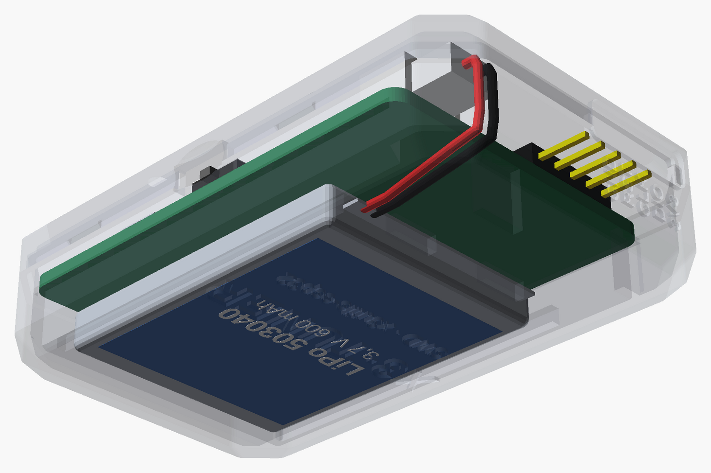
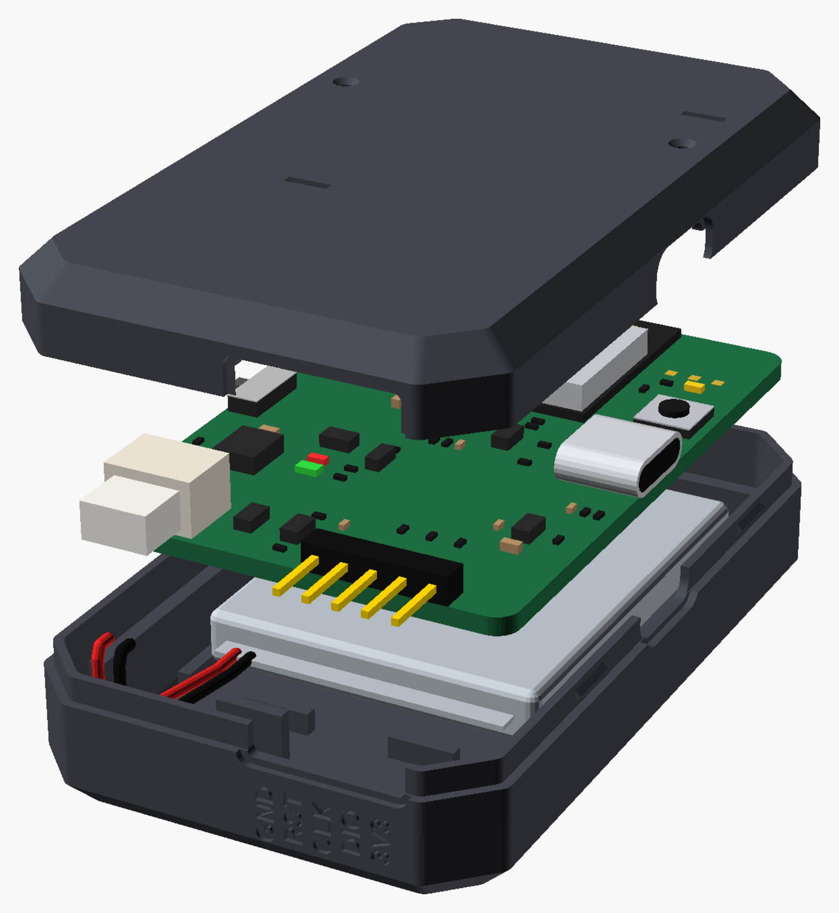
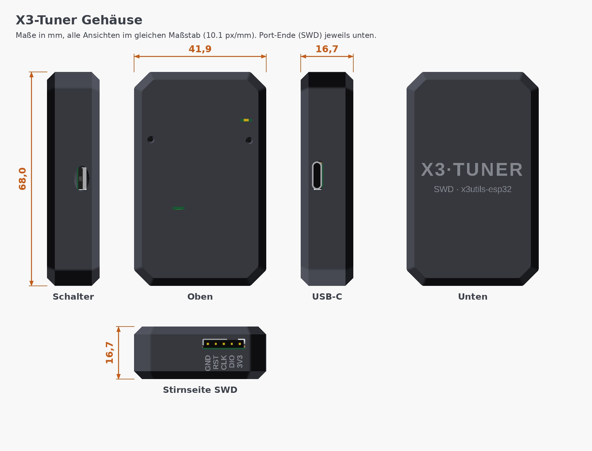

# X3-Tuner Gehäuse (3D-Druck)

Zweiteiliges Rast-Gehäuse im **facettierten „Stick"-Design** für die
X3-Tuner-Platine **plus Akku**, ohne Schrauben. Es hat eine flache Ober- und
Unterseite, 45°-Fasen an allen Kanten und abgeschrägte Ecken. Gedruckt wird
es am besten in mattem Schwarz. Außenmaß **ca. 42 × 68 × 17 mm**.

| Zusammengebaut | Durchsichtig (Aufbau) |
|---|---|
|  |  |
| **Schnitt: Schichtaufbau** | **Von unten: Akku und Kabelführung** |
|  |  |
| **Explosionsansicht** | |
|  | |



## Aufbau von unten nach oben

| Ebene | Höhe |
|---|---|
| Boden | 1,2 mm |
| 503040-LiPo im Fach mit Führungsstegen | 5,6 mm |
| Luft für Lötstellen und USB-C-Beinchen | 1,5 mm |
| Platine auf Auflageleisten, Bauteile oben | 1,6 mm |
| Platz für die Bauteile (höchstes Teil: JST-Buchse, 4,9 mm) | 5,4 mm |
| Deckel | 1,4 mm |
| **Gesamt** | **16,7 mm** |

Die Trennfuge liegt auf Höhe der Platinenoberseite. Der Rastrand der
Unterschale greift in den Deckel.

## Dateien

| Datei | Inhalt |
|---|---|
| `stl/x3tuner-case-bottom.stl` | Unterschale: Akkufach, Auflagen für die Platine, Rastrand, Logo-Gravur |
| `stl/x3tuner-case-lid.stl` | Deckel: Lichtschlitze, Pin-Löcher RESET/BOOT, Niederhalter |
| `stl/x3tuner-case-print.stl` | beide Teile druckfertig auf einer Platte (Deckel liegt kopfüber) |
| `x3tuner_case.scad` | parametrisches OpenSCAD-Modell |
| `board_data.scad` | Bauteilpositionen, automatisch aus `gen/circuit.py` und der KiCad-Platine erzeugt |

## Details

* **Akku:** Fach für einen **503040-LiPo** (30 × 40 × 5 mm, ca. 600 mAh) unter
  der Platine, Grundfläche bis 31,5 × 42 mm. Für andere Akkus
  `BAT = [Breite, Länge, Dicke]` in der `.scad` ändern und neu exportieren.
* **USB-C** rechts, **Ein/Aus-Schieber** links mit Griffmulde (jeweils mit
  dem SWD-Ende zu dir). Den Hebel des MSK12C02 schiebst du mit dem Fingernagel.
* **SWD-Port** an der Stirnseite: Ein 5-poliges Dupont-Buchsengehäuse wird
  durch den Schlitz auf die Stiftleiste gesteckt. Die Belegung
  (3V3, DIO, CLK, RST, GND) ist unter dem Schlitz eingraviert.
* **LEDs:** zwei offene Lichtschlitze (3,8 × 0,9 mm) im Deckel. Kleine
  Schächte darunter verhindern, dass sich das Licht im Gehäuse verteilt.
  Vorne links sitzt die Lade-LED (rot/grün), hinten rechts die Status-LED.
* **Tasten:** RESET und BOOT erreichst du durch zwei versenkte Pin-Löcher
  (1,3 mm) mit einer Büroklammer. Ein Führungsröhrchen lenkt sie auf den Taster.
  So drückt niemand aus Versehen.
* **Halt:** Der Deckel rastet mit vier Nasen ein, zwei je Längsseite. Vier
  Stifte im Deckel drücken die Platine auf ihre Auflagen. Schrauben braucht es nicht.
* **Unterseite:** eingraviertes Logo „X3·TUNER". Es ist lesbar, wenn du das
  Gerät über die Längsachse umdrehst.
* **Antenne:** Am Antennenende ist das Gehäuse 3 mm länger als die Platine.
  Dort liegt kein Metall in der Nähe des Moduls.

## Drucken

* PLA oder PETG, 0,2 mm Schichthöhe, 3 Wände, 15–20 % Infill, **ohne Stützen**.
  Alle Fasen haben 45°, das geht ohne Stützen.
* Unterschale mit dem Boden aufs Druckbett, **Deckel mit der Oberseite aufs Bett**.
  So liegt es schon in `print.stl`.
* Druckzeit ca. 1,5–2 h, ca. 13–16 g Material.
* Optional: die Gravuren (Logo, Pin-Namen) mit einem hellen Lackstift ausfüllen.
  In den Renderings ist das hellgrau angedeutet.

## Zusammenbau

1. Stiftleiste J3 an die Platine löten. Die kurzen Pin-Enden auf der Unterseite
   auf ca. 1 mm kürzen.
2. Akku mit doppelseitigem Klebeband ins Fach legen, die Kabelseite zum SWD-Ende.
   Das Kabel läuft am Boden zum SWD-Ende und dort hinter der Platinenkante nach
   oben zum Stecker J2 (siehe Ansicht von unten).
3. Akku einstecken (**Polarität prüfen!**). Dann die Platine einlegen: Bauteile
   nach oben, Stiftleiste zum Schlitz.
4. Deckel aufsetzen und an allen vier Rastnasen einrasten lassen. Zum Öffnen die
   Längsseiten leicht auseinanderziehen.

## Anpassen

```bash
# nach Änderungen an Platine (circuit.py) oder Gehäuse:
hardware/gen/make_case.sh     # board_data.scad, STL-Dateien, alle Bilder
```

Wichtige Parameter oben in `x3tuner_case.scad`:

* `BAT` (Akkufach)
* `FACET` und `CORNER` (Größe der Fasen)
* `WALL`
* `FIT` (Passung des Rastrands, bei strammem Sitz auf 0,2 erhöhen)
* `TOP_CLEAR`, `PIN_HOLE`, `SLIT`

Die Vorschau-Teile wählst du mit `part`:

* `assembly`: geschlossen
* `xray`: durchsichtig
* `section`: Schnitt
* `exploded`: Explosionsansicht

Mit `-D USE_STL=true` laden diese Ansichten die fertigen STL-Dateien. Das ist
schneller und die Transparenz wird sauberer dargestellt.
